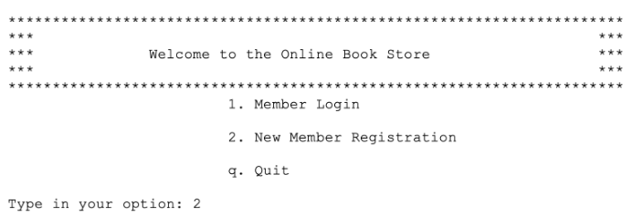
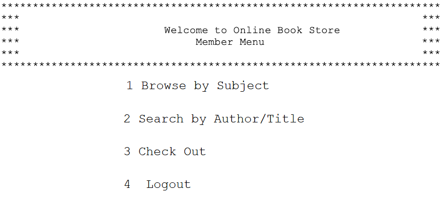

# Overview

Here I implemented a small console application that simulates a book store, with full CRUD operations using an SQL database for permanance. This project was part of final coursework for a course on Databases during my B.Sc studies in Computer Science.

The console app is written in Python and all data operations are handled by SQL queries.

### The main screen for a member looks like this:

Example for browsing:

